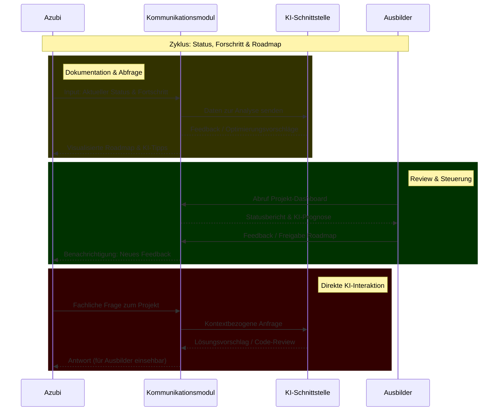
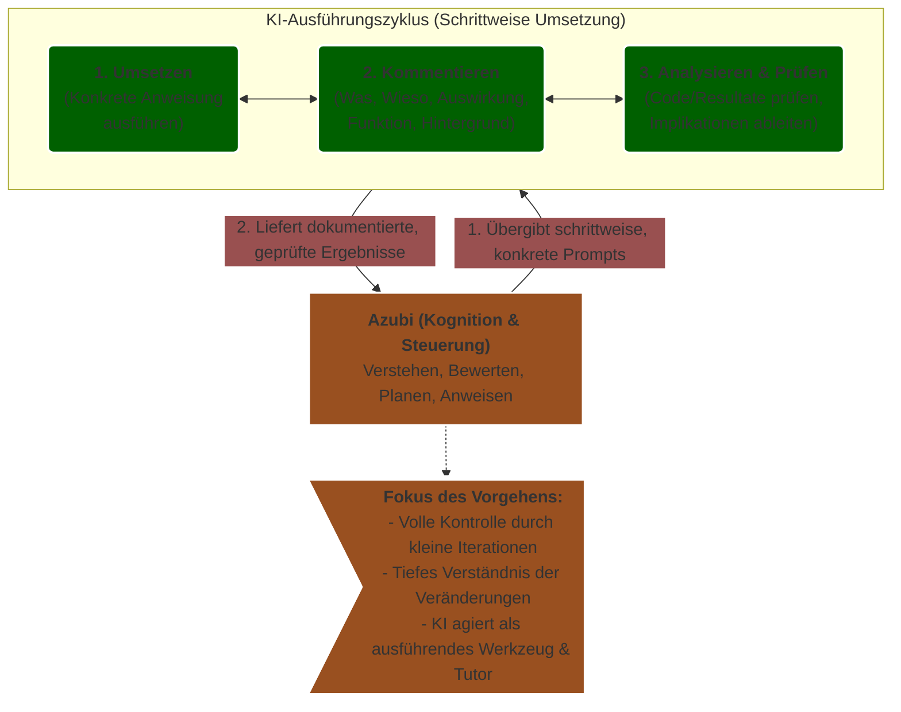

## Azubi <--> Ausbilder

```mermaid
%% Datum: 2026-04-02
%% Version: 1.0
%% Dateiname: kommunikation_azubi_ausbilder_ki.mermaid
%% Chat-ID: N/A

sequenceDiagram
    participant Azubi
    participant KM as Kommunikationsmodul
    participant KI as KI-Schnittstelle
    participant Ausbilder

    Note over Azubi, Ausbilder:  Zyklus: Status, Forschritt & Roadmap

    rect rgb(50, 50, 0)
    Note right of Azubi: Dokumentation & Abfrage
    Azubi->>KM: Input: Aktueller Status & Fortschritt
    KM->>KI: Daten zur Analyse senden
    KI-->KM: Feedback / Optimierungsvorschläge
    KM-->>Azubi: Visualisierte Roadmap & KI-Tipps
    end

    rect rgb(0, 50, 0)
    Note right of Ausbilder: Review & Steuerung
    Ausbilder->>KM: Abruf Projekt-Dashboard
    KM-->>Ausbilder: Statusbericht & KI-Prognose
    Ausbilder->>KM: Feedback / Freigabe Roadmap
    KM-->>Azubi: Benachrichtigung: Neues Feedback
    end

    rect rgb(50, 0, 0)
    Note right of KI: Direkte KI-Interaktion
    Azubi->>KM: Fachliche Frage zum Projekt
    KM->>KI: Kontextbezogene Anfrage
    KI-->>KM: Lösungsvorschlag / Code-Review
    KM-->>Azubi: Antwort (für Ausbilder einsehbar)
    end
```

## Azubi <--> KI / Projekt

```mermaid
%% Datum: 2026-04-02
%% Version: 1.0
%% Dateiname: azubi_ki_vorgehensmodell.mermaid
%% Chat-ID: N/A

%% Hintergrundfarbe für alle labels (beschriftungen auf den Pfeilen)
%%{init: {'themeVariables': { 'edgeLabelBackground':'#995050'}}}%%

graph TD
    %% Styling Klassen für bessere visuelle Trennung
    classDef azubi fill:#995020,stroke:#fff,stroke-width:2px;
    classDef ki_zyklus fill:#006000,stroke:#fff,stroke-width:2px;
    %% classDef doku fill:#006000,stroke:#ff9800,stroke-width:2px;
    classDef fokus fill:#995020,stroke:#fff,stroke-width: 5px;
    classDef ki_interaktion fill:#995050,stroke:#fff,stroke-dasharray: 5 5;

    %% Hauptakteure / Prozessschritte
    A["<b>Azubi (Kognition & Steuerung)</b><br/>Verstehen, Bewerten, Planen, Anweisen"]:::azubi

    subgraph KI_Interaktion ["KI-Ausführungszyklus (Schrittweise Umsetzung)"]
        direction LR
        P1("<b>1. Umsetzen</b><br/>(Konkrete Anweisung<br/>ausführen)"):::ki_zyklus
        P2("<b>2. Kommentieren</b><br/>(Was, Wieso, Auswirkung,<br/>Funktion, Hintergrund)"):::ki_zyklus
        P3("<b>3. Analysieren & Prüfen</b><br/>(Code/Resultate prüfen,<br/>Implikationen ableiten)"):::ki_zyklus
        
        P1 <--> P2
        P2 <--> P3
    end

    %% Verbindungen (Der Loop)
    A -->|1. Übergibt schrittweise, konkrete Prompts| KI_Interaktion
    KI_Interaktion -->|2. Liefert dokumentierte, geprüfte Ergebnisse| A

    %% Fokus-Notiz für den Ausbilder
    N1><b>Fokus des Vorgehens:</b><br/>- Volle Kontrolle durch kleine Iterationen<br/>- Tiefes Verständnis der Veränderungen<br/>- KI agiert als ausführendes Werkzeug & Tutor]:::fokus
    A -.-> N1
```
