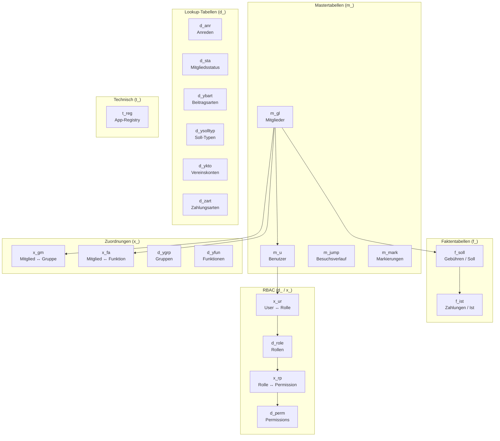
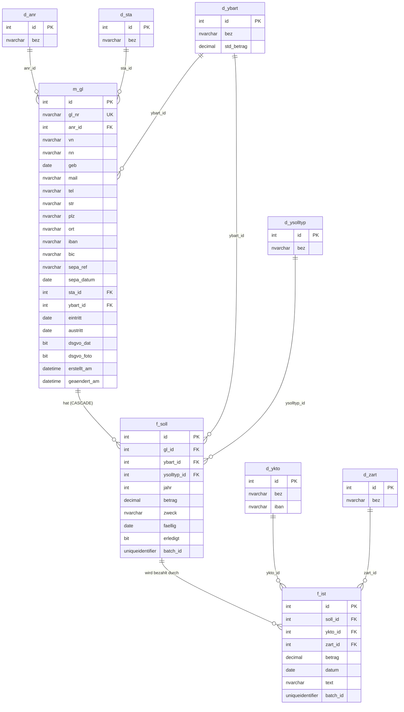
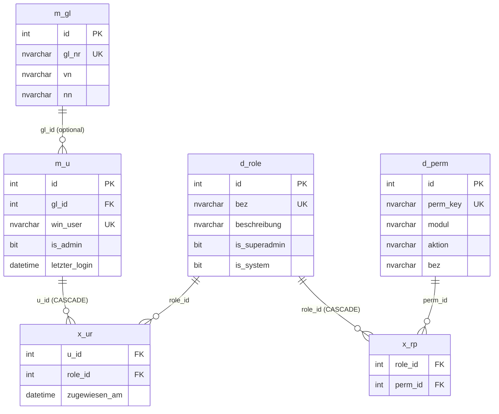
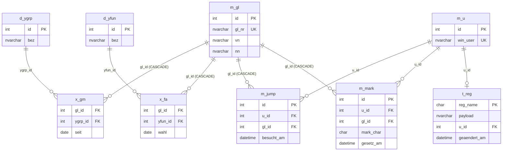
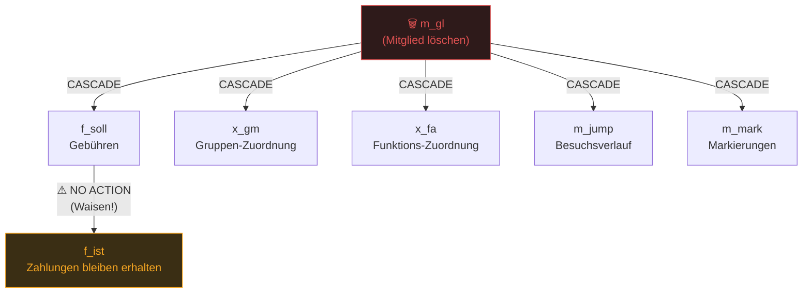

# yam3 — Datenbankschema-Diagramme

Schema: `[yam3]` | DB: `ovaya_test` | Stand: 2026-04-01

---

## 1. Gesamtübersicht (Tabellengruppen)

---

## 2. Kern-Entitäten: Mitglieder, Gebühren, Zahlungen

---

## 3. Benutzerverwaltung & RBAC

---

## 4. Gruppen, Funktionen & technische Tabellen

---

## 5. CASCADE-Übersicht

> Welche Daten werden beim Löschen eines Eintrags automatisch mitgelöscht?

---

## 6. FK-Referenzmatrix

| Von | Spalte | → Nach | ON DELETE |
|-----|--------|--------|-----------|
| `m_gl` | `anr_id` | `d_anr.id` | NO ACTION |
| `m_gl` | `sta_id` | `d_sta.id` | NO ACTION |
| `m_gl` | `ybart_id` | `d_ybart.id` | NO ACTION |
| `f_soll` | `gl_id` | `m_gl.id` | **CASCADE** |
| `f_soll` | `ybart_id` | `d_ybart.id` | NO ACTION |
| `f_soll` | `ysolltyp_id` | `d_ysolltyp.id` | NO ACTION |
| `f_ist` | `soll_id` | `f_soll.id` | NO ACTION |
| `f_ist` | `ykto_id` | `d_ykto.id` | NO ACTION |
| `f_ist` | `zart_id` | `d_zart.id` | NO ACTION |
| `m_u` | `gl_id` | `m_gl.id` | NO ACTION |
| `x_ur` | `u_id` | `m_u.id` | **CASCADE** |
| `x_ur` | `role_id` | `d_role.id` | NO ACTION |
| `x_rp` | `role_id` | `d_role.id` | **CASCADE** |
| `x_rp` | `perm_id` | `d_perm.id` | NO ACTION |
| `m_jump` | `gl_id` | `m_gl.id` | **CASCADE** |
| `m_jump` | `u_id` | `m_u.id` | NO ACTION |
| `m_mark` | `gl_id` | `m_gl.id` | **CASCADE** |
| `m_mark` | `u_id` | `m_u.id` | NO ACTION |
| `x_gm` | `gl_id` | `m_gl.id` | **CASCADE** |
| `x_gm` | `ygrp_id` | `d_ygrp.id` | NO ACTION |
| `x_fa` | `gl_id` | `m_gl.id` | **CASCADE** |
| `x_fa` | `yfun_id` | `d_yfun.id` | NO ACTION |
